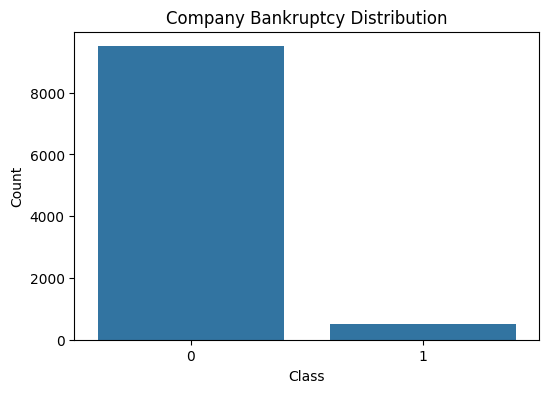
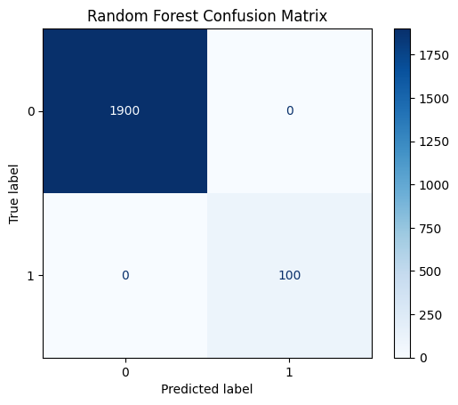

# Company Bankruptcy Prediction using Machine Learning

## Project Overview

This project focuses on predicting whether a company is likely to go bankrupt based on its financial indicators using Machine Learning classification algorithms. Bankruptcy prediction is an important financial risk assessment task that helps investors, financial institutions, and organizations identify financially distressed companies at an early stage.

The project follows a complete Machine Learning workflow, including data preprocessing, exploratory data analysis (EDA), model training, model evaluation, feature importance analysis, and model saving for future deployment.

---

## Project Objective

The objective of this project is to build a machine learning model capable of accurately classifying companies into two categories:

- **0** → Non-Bankrupt Company
- **1** → Bankrupt Company

The trained model can assist in early financial risk assessment and support better business decision-making.

---

## Dataset Information

| Attribute | Value |
|-----------|-------|
| Total Records | 10,000 |
| Total Features | 30 |
| Target Variable | `class` |
| Missing Values | 0 |
| Duplicate Records | 0 |

The dataset consists of financial ratios and business-related indicators commonly used for bankruptcy prediction.

---

## Technologies Used

- Python
- Google Colab
- Pandas
- NumPy
- Matplotlib
- Seaborn
- Scikit-learn
- Joblib
- GitHub

---

## Project Workflow

```
Load Dataset
      │
      ▼
Data Exploration
      │
      ▼
Exploratory Data Analysis (EDA)
      │
      ▼
Data Preprocessing
      │
      ▼
Train-Test Split
      │
      ▼
Feature Scaling
      │
      ▼
Model Training
      │
      ▼
Model Evaluation
      │
      ▼
Feature Importance Analysis
      │
      ▼
Save Best Model
```

---

## Exploratory Data Analysis

The dataset was analyzed before model training to understand its characteristics.

The following checks were performed:

- Dataset overview
- Missing value analysis
- Duplicate record detection
- Class distribution visualization
- Correlation analysis
- Feature importance analysis

---

## Machine Learning Models

The following classification models were trained and evaluated:

- Logistic Regression
- Decision Tree Classifier
- Random Forest Classifier
- Gradient Boosting Classifier

---

## Evaluation Metrics

The models were evaluated using the following performance metrics:

- Accuracy
- Precision
- Recall
- F1 Score

---

## Model Performance

| Model | Accuracy | Precision | Recall | F1 Score |
|--------|----------|-----------|--------|----------|
| Logistic Regression | 1.00 | 1.00 | 1.00 | 1.00 |
| Decision Tree | 1.00 | 1.00 | 1.00 | 1.00 |
| Random Forest | 1.00 | 1.00 | 1.00 | 1.00 |
| Gradient Boosting | 1.00 | 1.00 | 1.00 | 1.00 |

> **Note:** All evaluated models achieved excellent performance on the provided dataset. The Random Forest model was selected as the final model due to its strong predictive capability and feature importance analysis.

---

## Important Features

The Random Forest model identified the following financial indicators as the most influential features for bankruptcy prediction:

- Current Assets / Total Liabilities
- Short-Term Liabilities / Total Assets
- Current Assets / Short-Term Liabilities
- Profit on Sales
- Equity Fixed Assets
- Total Liabilities / Total Assets
- EBIT / Sales
- Constant Capital / Fixed Assets
- Gross Profit / Short-Term Liabilities
- Working Capital

---

## Project Structure

```
company-bankruptcy-prediction/
│
├── data/
│   └── company_bankruptcy.csv
│
├── notebooks/
│   └── Company_Bankruptcy_Prediction.ipynb
│
├── models/
│   ├── bankruptcy_model.pkl
│   └── scaler.pkl
│
├── images/
│   ├── class_distribution.png
│   ├── confusion_matrix.png
│   └── feature_importance.png
│
├── requirements.txt
├── README.md
├── LICENSE
└── .gitignore
```

---

## Visualizations

### Class Distribution



---

### Confusion Matrix



---

### Top 10 Feature Importance


---

## How to Run the Project

### Clone the repository

```bash
git clone https://github.com/YOUR_USERNAME/company-bankruptcy-prediction.git
```

### Move into the project directory

```bash
cd company-bankruptcy-prediction
```

### Install dependencies

```bash
pip install -r requirements.txt
```

### Open the notebook

Launch Jupyter Notebook or upload the notebook to Google Colab and run all cells sequentially.

---

## Future Improvements

- Hyperparameter tuning using GridSearchCV
- Cross-validation
- XGBoost implementation
- LightGBM implementation
- SHAP explainability
- Streamlit web application
- Cloud deployment

---

## Author

**Yashi Kardam**

B.Tech Information Technology

Interested in Machine Learning, Artificial Intelligence, Data Science, and Software Development.

---

## License

This project is licensed under the MIT License.
